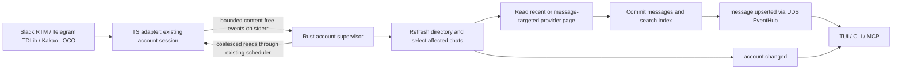

# Account live synchronization

The daemon keeps configured accounts connected even without a TUI. It receives
provider hints, reconciles affected messages, persists observations in the shared
message/search index, and publishes `message.upserted` after commit. Directory
refreshes separately publish `account.changed`. TUI, CLI and MCP share the same daemon state; any protocol
client can subscribe to that event and inspect `sync.status`.

## Ownership and transport

- TS owns SDK session and transport lifecycle. Slack uses the pinned SDK RTM
  listener and its heartbeat/reconnect. Telegram attaches to the existing TDLib
  update callback. Kakao attaches to the same client's push/session callbacks.
  No second Telegram database or Kakao device login is opened for receiving.
- Worker stdout remains serialized request/response JSONL. With
  `INBOXD_ACCOUNT_LIVE=1`, stderr is a separate JSONL invalidation channel:
  `{"event":"changed"}` (optionally `chat_id` and `message_id`),
  `{"event":"deleted","chat_id":"…","message_id":"…"}`, `{"event":"gap"}`,
  or `{"event":"state","state":"connected|disconnected|unsupported"}`.
  It carries no credentials, message bodies or provider-chosen account identity.
- The emitter coalesces bursts for 100 ms and retains at most one dirty bit and
  the latest state plus at most 1,024 distinct targeted hints under pipe backpressure.
  Overflow reports an evidence gap instead of silently claiming complete delivery. Rust reads continuously, including
  while stdout is idle or busy with a send. It validates exact fields, limits
  frames to 1 KiB, and coalesces them in a watch channel.
- Rust owns one reconciliation task per configured account, its scheduling,
  cache generations, recovery reads, and public notifications. Existing FIFO
  scheduling and reserved send capacity still apply. Shutdown aborts receiving
  and refresh tasks and drops worker processes. No recovery path retries sends.

## Recovery and client behavior

Startup fetches the account directory and creates the session. Push bursts use
one fixed 750 ms coalescing window before a refresh. Events during a refresh
remain pending for another pass. Accounts run independently. A connected account
also reconciles every 60 seconds to repair missed notifications; disconnected or
unsupported push uses 30-second reads. Failed reads back off from 5 to 120 seconds
and preserve the last snapshot with an error. Reauthentication remains the normal
`inboxd connect` flow; the daemon never prompts for credentials in the background.

`account.changed` has daemon-owned `platform`, `account`, `state` and `phase`
(`refreshing` or `ready`). This is cache invalidation, not a durable message event.
Existing `message.upserted` continues to mean a storage commit. Slow UDS clients
retain the existing overflow behavior: disconnect, reconnect, subscribe, requery.

The TUI coalesces notifications, reloads directory snapshots, and reloads the
active chat only for the affected account. It preserves drafts and uses the
focused message as context when reading older history; at the bottom it follows
new messages. A subscription is not a TUI polling timer. `sync.status` reports
per-account transport state, refresh state and snapshot age; disconnected
providers must not be represented as a healthy live account.

## Bounds and limitations

Targeted pushes reconcile the named chat and, when supplied, the message ID
(including edits outside the recent page). Startup, reconnect and periodic sweeps
observe the recent page of **every accessible room**, including unopened rooms.
Directory changes also enqueue affected rooms. Each pass reads at most eight
pages through the existing account scheduler; pending batches yield for one
second plus the coalescing window. Half the batch is reserved for room sweeps so
message-specific bursts cannot indefinitely starve quiet rooms. Pending work
survives provider/storage failures and retries with the existing bounded backoff.
Pushes arriving during a read remain pending for a subsequent pass. Duplicate
observations do not publish a new message event.

These are bounded recent/context reads (provider page size, capped at 80 returned
messages), not a full-history crawl. Continuation cursors are not automatically
traversed. Large bursts, long outages, unavailable old context and provider limits
can leave unobserved history; partial observations never assert coverage.
Directory refresh remains account-wide and may be expensive on large accounts.
The 750 ms coalescing window is not an end-to-end latency guarantee.

`sync.status.accounts` exposes `pending_observation_rooms` and
`observation_failed`; provider or persistence failure degrades receiving status.
Authoritative Slack/Telegram deletion evidence is committed as a tombstone before
notification. Missing messages never imply deletion; deletion evidence gaps and
Kakao's unavailable authoritative deletion evidence remain explicit.

Kakao's patched `getChats({all:true})` traverses the server directory from zero
instead of returning the login snapshot, including after a fresh login. This is
necessary for new rooms and current previews to become visible during a session.

Live observation and explicit account history/search reads share the
[search foundation](20-search-foundation.md). Recent unopened messages are collected
automatically; full history and offline edits/deletions outside observed pages
are not guaranteed collected. `sync.status` separates receiving
state from read/persistence/backfill work status.

Slack RTM availability depends on the existing personal session. Official Slack
RTM is a legacy API; new Slack apps cannot use it. This implementation does not
promise support for a newly registered Slack app or change authentication modes.
Sources: [Slack RTM](https://docs.slack.dev/legacy/legacy-rtm-api/),
[rtm.connect](https://docs.slack.dev/reference/methods/rtm.connect/),
[TDLib new message updates](https://core.telegram.org/tdlib/docs/classtd_1_1td__api_1_1update_new_message.html).

Validation uses synthetic SDK events and provider processes. Live accounts have
not been used to establish end-to-end delivery or long-running reconnection
reliability for this change.

Initial real-account checks and a content-free observation run are now tracked in
[Live reliability validation](21-live-reliability-validation.md). Those checks
found a stale local-search result after a Slack deletion; the P0 matrix remains
incomplete and long-running reliability is not yet established.

Validation on 2026-09-19: 691 Bun tests passed with no failures, including real
UDS CLI/MCP/TUI tests using retained release test-feature binaries. Full Rust
workspace tests with all features, strict Clippy, TypeScript checks, import
boundaries and production artifact builds passed. Regression coverage includes
side-channel delivery while the request channel is idle, burst/backpressure
coalescing, short reconnect gaps, failed-read backoff, callback cleanup, Kakao
fresh-login directory refresh, and TUI draft/focus preservation.

## Reads on another Kakao device (2026-09-22)

Kakao read notifications, including `NOTIREAD`, invalidate the directory. Their
payload is never treated as proof of the owner's read: another participant can
emit the same kind of receipt. The daemon re-fetches `LCHATLIST`, and the SDK
preserves its `s` field as a decimal-string `last_seen_log_id`. The Kakao backend
passes it as `read_through` alongside the unread count. If the same directory
snapshot reports `n=0`, its `ll` (exposed as `last_log_id`) also bounds the fully
read range: the effective cursor is the larger of `s` and `ll`. A later history
page is never used to extend this zero-unread snapshot boundary.

The shared encrypted unread evidence retains that monotonic cursor. Local unseen
rows and recommendation sources at or below it no longer count as unread. A late
history page or older directory cannot revive them; messages after the cursor
remain unread even if they arrived after a zero-count directory snapshot. Decimal
IDs are compared without floating-point conversion. Response sessions drop already-read source IDs from unread navigation, while
prepared, unsent recommendations remain available for the same message context
and model runtime. Reading on either device is not reply completion. Reopening
a room reuses that recommendation; successful sending retires it. The TUI also
preserves an already-written draft. No provider mark-read call
or synthetic local-view feedback is made to mirror another device's read.

Push handling and the existing periodic reconciliation both fetch this evidence.
This is eventually consistent with provider delivery and refresh completion, not
an instantaneous synchronization guarantee. The cursor lives in the existing
SQLCipher evidence JSON, so this change does not require a new schema version.
