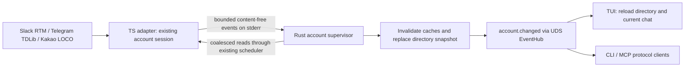

# Account live synchronization

The daemon keeps configured accounts connected even without a TUI. It receives
provider invalidations, reconciles account snapshots, and publishes
`account.changed`. TUI, CLI and MCP share the same daemon state; any protocol
client can subscribe to that event and inspect `sync.status`.

## Ownership and transport

- TS owns SDK session and transport lifecycle. Slack uses the pinned SDK RTM
  listener and its heartbeat/reconnect. Telegram attaches to the existing TDLib
  update callback. Kakao attaches to the same client's push/session callbacks.
  No second Telegram database or Kakao device login is opened for receiving.
- Worker stdout remains serialized request/response JSONL. With
  `INBOXD_ACCOUNT_LIVE=1`, stderr is a separate JSONL invalidation channel:
  `{"event":"changed"}` or
  `{"event":"state","state":"connected|disconnected|unsupported"}`.
  It carries no credentials, message bodies or provider-chosen account identity.
- The emitter coalesces bursts for 100 ms and retains at most one dirty bit and
  the latest state under pipe backpressure. Rust reads continuously, including
  while stdout is idle or busy with a send. It validates exact fields, limits
  frames to 1 KiB, and coalesces them in a watch channel.
- Rust owns one reconciliation task per configured account, its scheduling,
  cache generations, recovery reads, and public notifications. Existing FIFO
  scheduling and reserved send capacity still apply. Shutdown aborts receiving
  and refresh tasks and drops worker processes. No recovery path retries sends.

## Recovery and client behavior

Startup fetches the account directory and creates the session. Push bursts use
one fixed 750 ms coalescing window before a refresh. Events during a refresh
remain pending for another pass. Accounts run independently. A connected account
also reconciles every 60 seconds to repair missed notifications; disconnected or
unsupported push uses 30-second reads. Failed reads back off from 5 to 120 seconds
and preserve the last snapshot with an error. Reauthentication remains the normal
`inboxd connect` flow; the daemon never prompts for credentials in the background.

`account.changed` has daemon-owned `platform`, `account`, `state` and `phase`
(`refreshing` or `ready`). This is cache invalidation, not a durable message event.
Existing `message.upserted` continues to mean a storage commit. Slow UDS clients
retain the existing overflow behavior: disconnect, reconnect, subscribe, requery.

The TUI coalesces notifications, reloads directory snapshots, and reloads the
active chat only for the affected account. It preserves drafts and uses the
focused message as context when reading older history; at the bottom it follows
new messages. A subscription is not a TUI polling timer. `sync.status` reports
per-account transport state, refresh state and snapshot age; disconnected
providers must not be represented as a healthy live account.

## Bounds and limitations

This implementation reconciles the account directory per invalidation rather than
patching rows from raw provider payloads. Large accounts may need multiple API
calls and provider rate limits can delay display. The 750 ms window is not an
end-to-end latency guarantee. Future per-chat reconciliation can reduce that cost
without moving policy into adapters.

Kakao's patched `getChats({all:true})` traverses the server directory from zero
instead of returning the login snapshot, including after a fresh login. This is
necessary for new rooms and current previews to become visible during a session.

Live directory reconciliation alone does not populate a full-history index.
Explicit account history/search reads now persist returned messages through the
[shared search foundation](20-search-foundation.md). Unopened history and offline
edits/deletions are not guaranteed collected. `sync.status` separates receiving
state from read/persistence/backfill work status.

Slack RTM availability depends on the existing personal session. Official Slack
RTM is a legacy API; new Slack apps cannot use it. This implementation does not
promise support for a newly registered Slack app or change authentication modes.
Sources: [Slack RTM](https://docs.slack.dev/legacy/legacy-rtm-api/),
[rtm.connect](https://docs.slack.dev/reference/methods/rtm.connect/),
[TDLib new message updates](https://core.telegram.org/tdlib/docs/classtd_1_1td__api_1_1update_new_message.html).

Validation uses synthetic SDK events and provider processes. Live accounts have
not been used to establish end-to-end delivery or long-running reconnection
reliability for this change.

Initial real-account checks and a content-free observation run are now tracked in
[Live reliability validation](21-live-reliability-validation.md). Those checks
found a stale local-search result after a Slack deletion; the P0 matrix remains
incomplete and long-running reliability is not yet established.

Validation on 2026-09-19: 691 Bun tests passed with no failures, including real
UDS CLI/MCP/TUI tests using retained release test-feature binaries. Full Rust
workspace tests with all features, strict Clippy, TypeScript checks, import
boundaries and production artifact builds passed. Regression coverage includes
side-channel delivery while the request channel is idle, burst/backpressure
coalescing, short reconnect gaps, failed-read backoff, callback cleanup, Kakao
fresh-login directory refresh, and TUI draft/focus preservation.
